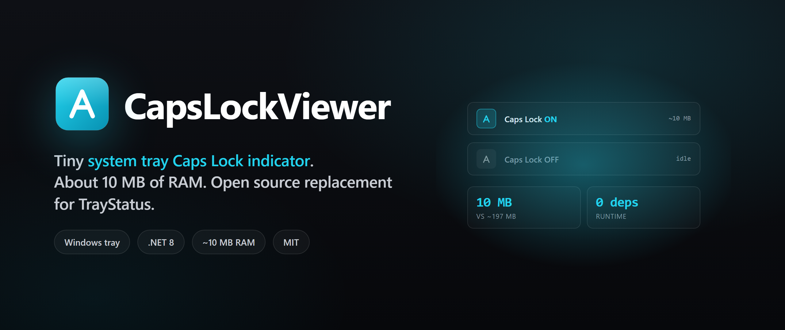

<p align="center">
  
</p>

<h3 align="center">
  Tiny Caps Lock tray indicator. About 10 MB of RAM.
</h3>

<p align="center">
  Cyan A when Caps is on, white outline when it's off. Open source replacement for TrayStatus.
</p>

<p align="center">
  <a href="LICENSE"></a>
  
  
</p>

<p align="center">
  
  
  
</p>

---

A tiny Caps Lock indicator that sits in your Windows system tray. Cyan "A" when caps is on, white outline when it's off. Uses about 10 MB of RAM.

Built this because every other Caps Lock app I tried was weirdly heavy. TrayStatus eats ~197 MB to show one keyboard bit. This does the same thing in ~10.

 

## Run it from source

Needs the [.NET 8 SDK](https://dotnet.microsoft.com/download/dotnet/8.0).

```powershell
dotnet run --project CapsLockViewer.csproj -c Release
```

## Build a standalone exe

```powershell
dotnet publish CapsLockViewer.csproj -c Release
```

Drops a self-contained exe at `bin/Release/net8.0-windows10.0.19041.0/win-x64/publish/CapsLockViewer.exe` (~74 MB, no runtime needed on the target machine).

## Build the MSIX (Store / sideload)

Needs [Visual Studio 2022](https://visualstudio.microsoft.com/) or the build tools with the **Windows Application Packaging** workload.

```powershell
msbuild Package\CapsLockViewer.Package.wapproj /p:Configuration=Release /p:Platform=x64 /restore
```

Output lands at `Package/AppPackages/CapsLockViewer.Package_1.0.0.0_x64.msixbundle`.

Before submitting to the Store, swap `Identity Name` and `Publisher` in `Package/Package.appxmanifest` for the values from your Partner Center reservation, then rebuild.

## Regenerate the icons / Store tiles

```powershell
dotnet run --project CapsLockViewer.csproj -c Release -- --export-preview preview
dotnet run --project CapsLockViewer.csproj -c Release -- --export-store-assets Package\Assets
```

## How it actually works

- One file: `Program.cs`. `TrayContext` runs the tray icon; `IconFactory` draws the icons in memory.
- Caps state is polled with `user32!GetKeyState(VK_CAPITAL)` on a 150 ms timer. No keyboard hook.
- Only one copy runs at a time (named mutex). Extra launches just exit.
- Auto-start uses the MSIX `startupTask` when packaged, or `HKCU\...\Run` when it's a plain exe.
- Settings live in `LocalSettings` (packaged) or `HKCU\Software\CapsLockViewer` (unpackaged).
- Calls `EmptyWorkingSet` now and then to keep memory down near 10 MB.

## Layout

```
CapsLockViewer.csproj             the .NET 8 WinForms project
Program.cs                        all the code
app.manifest                      win32 manifest (asInvoker, longPathAware)
Package/                          MSIX packaging project + Store tiles
preview/                          tray icon PNGs for this README
brand/                            banner image
```

## Contributing

Keep it small. The whole thing is one source file and I'd like it to stay that way. Open an issue before anything bigger than a bug fix.

## License

[MIT](LICENSE). © 2026 RemielDev.
